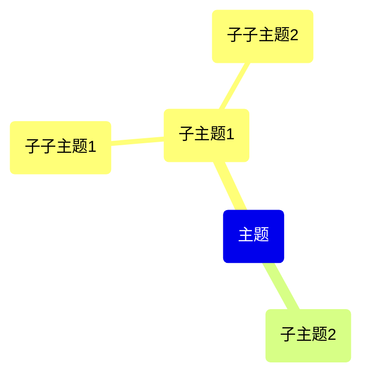

# Mermaid Mindmap 转无序列表工具

这个工具可以将 Mermaid mindmap 语法转换为 Markdown 无序列表格式，保持原有的层级结构。

## 功能特点

- 支持中文内容
- 自动识别层级结构
- 可处理 Markdown 文件中的 mermaid 代码块
- 支持输出到文件或控制台

## 使用方法

### 基本用法

```bash
# 输出到控制台
python mermaid_to_list.py input.md

# 输出到文件
python mermaid_to_list.py input.md output.md
```

### 输入格式

支持两种输入格式：

1. **Markdown 文件中的 mermaid 代码块**：
```markdown


2. **纯 mermaid 内容**：
```
mindmap
  root(主题)
    (子主题1)
      (子子主题1)
      (子子主题2)
    (子主题2)
```

### 输出格式

转换后的无序列表格式：
```markdown
- 主题
  - 子主题1
    - 子子主题1
    - 子子主题2
  - 子主题2
```

## 示例

使用提供的示例文件：
```bash
python mermaid_to_list.py example_mindmap.md
```

输出结果：
```
- 项目管理
  - 计划阶段
    - 需求分析
      - 用户调研
      - 功能定义
    - 时间规划
      - 里程碑设定
      - 任务分解
  - 执行阶段
    - 开发工作
      - 前端开发
      - 后端开发
      - 数据库设计
    - 测试工作
      - 单元测试
      - 集成测试
  - 收尾阶段
    - 部署上线
    - 文档整理
    - 项目总结
```

## 注意事项

- 脚本会自动跳过空行和 `mindmap` 声明行
- 支持 `root()` 和普通 `()` 语法
- 层级结构基于缩进识别（每 2 个空格为一层）
- 输出使用 UTF-8 编码，确保中文显示正常

## 文件说明

- `mermaid_to_list.py` - 主脚本文件
- `example_mindmap.md` - 示例输入文件
- `README_mermaid_converter.md` - 使用说明（本文件）
