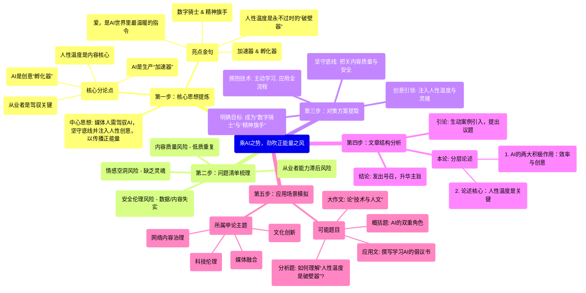

```mermaid
mindmap
  root(乘AI之势，劲吹正能量之风)
    (第一步：核心思想提炼)
      (中心思想: 媒体人需驾驭AI，坚守底线并注入人性创意，以传播正能量)
      (核心分论点)
        (AI是生产“加速器”)
        (AI是创意“孵化器”)
        (人性温度是内容核心)
        (从业者是驾驭关键)
      (亮点金句)
        (加速器 & 孵化器)
        (爱，是AI世界里最温暖的指令)
        (人性温度是永不过时的“破壁器”)
        (数字骑士 & 精神旗手)

    (第二步：问题清单梳理)
      (内容质量风险 - 低质重复)
      (情感空洞风险 - 缺乏灵魂)
      (安全伦理风险 - 数据/内容失实)
      (从业者能力滞后风险)

    (第三步：对策方案提取)
      (拥抱技术: 主动学习, 应用全流程)
      (坚守底线: 把关内容质量与安全)
      (创意引领: 注入人性温度与灵魂)
      (明确目标: 成为“数字骑士”与“精神旗手”)

    (第四步：文章结构分析)
      (引论: 生动案例引入，提出议题)
      (本论: 分层论述)
        (1. AI的两大积极作用：效率与创意)
        (2. 论述核心：人性温度是关键)
      (结论: 发出号召，升华主旨)

    (第五步：应用场景模拟)
      (可能题目)
        (概括题: AI的双重角色)
        (分析题: 如何理解“人性温度是破壁器”?)
        (应用文: 撰写学习AI的倡议书)
        (大作文: 论“技术与人文”)
      (所属申论主题)
        (媒体融合)
        (网络内容治理)
        (科技伦理)
        (文化创新)
```