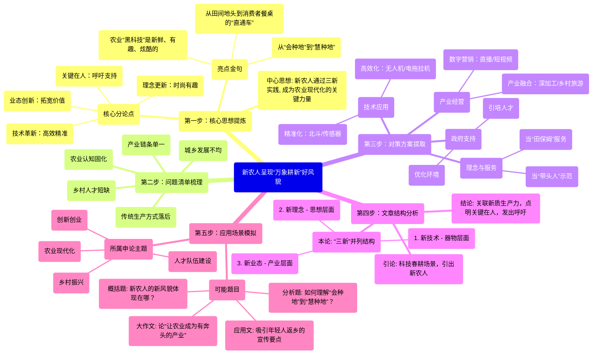

```mermaid
mindmap
  root(新农人呈现“万象耕新”好风貌)
    (第一步：核心思想提炼)
      (中心思想: 新农人通过三新实践, 成为农业现代化的关键力量)
      (核心分论点)
        (技术革新：高效精准)
        (理念更新：时尚有趣)
        (业态创新：拓宽价值)
        (关键在人：呼吁支持)
      (亮点金句)
        (从“会种地”到“慧种地”)
        (农业“黑科技”是新鲜、有趣、炫酷的)
        (从田间地头到消费者餐桌的“直通车”)

    (第二步：问题清单梳理)
      (传统生产方式落后)
      (乡村人才短缺)
      (农业认知固化)
      (产业链条单一)
      (城乡发展不均)

    (第三步：对策方案提取)
      (技术应用)
        (精准化：北斗/传感器)
        (高效化：无人机/电拖拉机)
      (理念与服务)
        (当“带头人”示范)
        (当“田保姆”服务)
      (产业经营)
        (数字营销：直播/短视频)
        (产业融合：深加工/乡村旅游)
      (政府支持)
        (引培人才)
        (优化环境)

    (第四步：文章结构分析)
      (引论: 科技春耕场景，引出新农人)
      (本论: “三新”并列结构)
        (1. 新技术 - 器物层面)
        (2. 新理念 - 思想层面)
        (3. 新业态 - 产业层面)
      (结论: 关联新质生产力，点明关键在人，发出呼吁)

    (第五步：应用场景模拟)
      (可能题目)
        (概括题: 新农人的新风貌体现在哪？)
        (分析题: 如何理解“会种地”到“慧种地”？)
        (应用文: 吸引年轻人返乡的宣传要点)
        (大作文: 论“让农业成为有奔头的产业”)
      (所属申论主题)
        (乡村振兴)
        (农业现代化)
        (人才队伍建设)
        (创新创业)
```