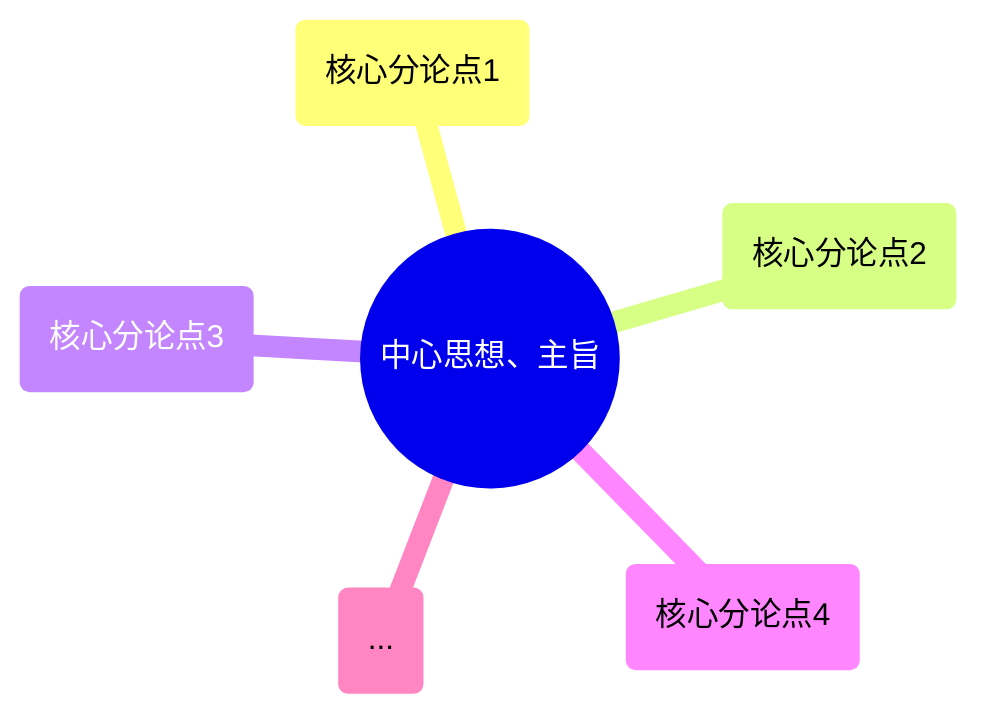

# 申论学习黄金结构拆解法

您提的这个问题非常好，这正是申论学习的核心方法之一：**将一篇高质量的策论文章“吃透”，把它从“阅读材料”转化为自己的“申论弹药库”**。

<!-- truncate -->

对于您手头的大量类似文章，我建议您建立一个标准化的【申论文章拆解与吸收框架】。每次都用这个框架来处理一篇文章，久而久之，您的申论思维、素材积累和写作能力都会有质的飞跃。

以下是我为您设计的框架，并以您提供的《人民网评：扶志加扶智，让脱贫群众脚下路更宽》为例进行拆解示范：

---

这个方法将一篇文章从五个维度进行分解，分别对应申论考试的不同题型和能力要求。

- 第一步：核心思想提炼
  - 目标: 用于大作文立意
  - 操作
    - 一句话中心思想
    - 核心分论点
    - 亮点/金句摘抄
- 第二步：问题清单梳理
  - 目标: 用于概括与分析题
  - 操作: “问题+表现”形式
- 第三步：对策方案提取
  - 目标: 用于对策与应用文题
  - 操作
    - “动词+宾语”格式
    - 多维度分类
- 第四步：文章结构分析
  - 目标: 学习官方写作范式
  - 操作: 拆解“引-本-结”结构
- 第五步：应用场景模拟
  - 目标: 转化知识为我所用
  - 操作
    - 模拟出题
    - 主题归纳

**第一步：核心思想提炼 (定主题、抓总分)**
* **目标：** 快速锁定文章的中心论点和分论点，直接用于**大作文的立意和分论点设置**。
* **操作：**
    1.  **一句话中心思想：** 这篇文章最核心的观点是什么？
    2.  **核心分论点 (3-4个)：** 作者是从哪几个方面来支撑中心思想的？
    3.  **亮点/金句摘抄：** 摘抄文中的高度概括、形象生动或权威性强的句子，用于作文的标题、开头、结尾或段落中。

**第二步：问题清单梳理 (找问题、析原因)**
* **目标：** 识别文章中提到的问题、挑战或风险，用于**概括题和综合分析题**。
* **操作：**
    * 以“问题+表现”的形式列出。

**第三步：对策方案提取 (抄对策、学表述)**
* **目标：** 精准提炼文中提出的所有对策建议，用于**对策题和应用文写作**。
* **操作：**
    * 以“动词+宾语”的格式提炼，使其可以直接作为答案要点。
    * 将对策按“政府、社会、企业、个人”或“思想、制度、操作”等不同维度进行分类。

**第四步：文章结构分析 (学逻辑、仿行文)**
* **目标：** 分析文章的谋篇布局和论证逻辑，学习**官方文章的写作范式**。
* **操作：**
    * 拆解文章的“引论-本论-结论”结构，看它是如何提出问题、分析问题、解决问题的。

**第五步：应用场景模拟 (转知识、为我用)**
* **目标：** 将以上分析成果，转化为可以在考场上直接使用的形式。
* **操作：**
    * **模拟出题：** 假如你是出题人，会基于这篇文章出什么样的申论题目？
    * **主题归纳：** 这篇文章属于哪个申论主题？（如：乡村振兴、基层治理、民生保障等）

---

**【应用范例】拆解《人民网评：扶志加扶智》**

按照上述框架，我们来处理您提供的这篇文章：

**给您的学习建议**

1.  **建立专属笔记库：** 准备一个笔记本或电子文档，将每篇高质量文章都用上述框架进行拆解和记录。
2.  **分类整理：** 按照“乡村振兴”、“生态文明”、“社会治理”等申论常见主题，对您的笔记进行分类。
3.  **定期回顾：** 定期翻看您的笔记，特别是“金句”和“对策”，将它们内化为自己的语言。
4.  **坚持练习：** 坚持用这个方法处理文章，一个月后，您会发现自己看材料的速度、抓要点的准度以及思考问题的深度都会有显著提升。

这个方法的核心是**化被动阅读为主动分析**，将文章的血肉（观点、对策、金句）填充到申论的骨架（题型、逻辑）中去。祝您申论学习顺利，取得优异成绩！

---

# 申论五大核心主题

1. 政治领域 (Political Affairs)

- 核心： 政府自身建设与国家治理现代化。
- 常见考点：
  - 服务型政府建设： 优化营商环境、“放管服”改革（简政放权、放管结合、优化服务）、数字政府、政务公开、一网通办。
  - 法治政府建设： 依法行政、公正司法、社会公平正义、法治宣传教育。
  - 基层治理： 社区治理、网格化管理、“枫桥经验”、提升基层治理能力、为基层减负。
  - 党风廉政建设： 反腐败斗争、作风建设、监督体系。

2. 经济领域 (Economic Development)

- 核心： 推动高质量发展。
- 常见考点：
  - 宏观经济： 新发展格局（以国内大循环为主体、国内国际双循环相互促进）、供给侧结构性改革、扩大内需。
  - 创新驱动： 科技创新、关键核心技术、人才强国、知识产权保护。
  - 区域协调发展： 乡村振兴、区域重大战略（京津冀、长三角、粤港澳大湾区等）、城乡融合发展。
  - 产业发展： 现代化产业体系、数字经济、平台经济、实体经济发展、中小企业扶持。

3. 社会领域 (Social Issues)

- 核心： 保障和改善民生。这是申论考试中最为高频的领域。
- 常见考点：
  - 就业与创业： 重点群体（高校毕业生、农民工、退役军人）就业、新就业形态（如灵活就业）、创业带动就业。
  - 教育公平： “双减”政策、职业教育、义务教育均衡发展、教育资源普惠。
  - 医疗与养老： 健康中国战略、分级诊疗、公共卫生应急管理体系、应对人口老龄化、“一老一小”问题。
  - 社会保障： 住房保障（保障性租赁住房）、社会保险体系、社会救助。
  - 社会安全： 安全生产、食品药品安全、防灾减灾救灾、社会心态与矛盾化解。

4. 文化领域 (Cultural Advancement)

- 核心： 增强文化自信，建设社会主义文化强国。
- 常见考点：
  - 核心价值观： 培育和践行社会主义核心价值观、精神文明建设、时代楷模。
  - 文化传承与发展： 中华优秀传统文化创造性转化与创新性发展、非物质文化遗产保护、历史文化名城名镇保护。
  - 公共文化服务： 提升公共文化服务水平、全民阅读、文化产业发展、媒体融合发展。
  - 对外文化交流： 讲好中国故事、提升国家文化软实力。

5. 生态文明领域 (Ecological Civilization)

- 核心： 建设人与自然和谐共生的美丽中国。
- 常见考点：
  - 环境保护： 污染防治攻坚战（蓝天、碧水、净土保卫战）、垃圾分类。
  - 绿色发展： “两山”理论（绿水青山就是金山银山）、碳达峰与碳中和（“双碳”目标）、循环经济、绿色低碳生活方式。
  - 生态系统保护： 生物多样性保护、重要生态系统保护和修复（山水林田湖草沙一体化保护和系统治理）。

---

# 人民网评文章

## 扶志加扶智，让脱贫群众脚下路更宽

农业农村部近日在江西省赣州市召开巩固拓展脱贫攻坚成果工作推进会。会议指出，脱贫县农村居民人均可支配收入增速连续4年快于全国农村居民收入增速。这源于过渡期以来的接续帮扶，脱贫地区责任、政策、工作落地落实，帮扶产业持续发展壮大，脱贫劳动力务工就业规模稳中有增。

**巩固拓展脱贫攻坚成果是全面推进乡村振兴的底线任务**。2025年是巩固拓展脱贫攻坚成果同乡村振兴有效衔接5年过渡期的最后一年。相关地区和部门要毫不松懈抓好巩固拓展脱贫攻坚成果各项工作，提升防止返贫致贫监测帮扶效能，统筹建立农村防止返贫致贫机制和低收入人口、欠发达地区分层分类帮扶制度。在识别方面，要进一步优化监测机制，完善“一键报贫”等线上申报方式，强化部门筛查预警，充分发挥大数据比对和村基层组织作用，让数据多跑路、干部群众少跑腿。还要重点关注因病、因灾返贫等风险隐患，实现帮扶关口前移。对于有返贫致贫风险的农户，发现一个帮扶一个。做好应扶尽扶，避免返贫发生，动态消除风险。

**产业振兴是激发乡村内生发展动力的源泉，更是乡村全面振兴的基础和关键**。根据党中央以及国务院的部署要求，要“巩固一批、升级一批、盘活一批、调整一批”，促进帮扶产业高质量发展。要因地制宜选准优化产业方向，引育产业发展人才，提升设施装备条件，打造特色品牌。要用好管好帮扶项目资金，着力加强资产全链条监管，促进资产稳定良性运行。要发挥好东西部协作和中央单位定点帮扶作用，持续推进“万企兴万村”行动，促进脱贫地区产业健康发展，稳定提升脱贫劳动力务工就业质量及增收致富能力。

**要过好日子离不开实干，有志者事竟成**。帮扶工作还要把扶志与扶智结合起来，激发脱贫群众志气不能空泛，要助力其学技能长本事，“授人以渔”。结合劳务协作、就业帮扶车间等的实际需求，强化就业技能培训，让有关群众掌握一技之长，通过自身努力获得务工就业机会与发展空间。培养“造血”能力，加添信心志气，二者相辅相成，才能使脱贫群众脚下的路更宽。

**发展是巩固拓展脱贫攻坚成果的“金钥匙”**。要千方百计让脱贫地区和脱贫群众发展起来，通过发展带动帮扶，以帮扶促进发展，在推进乡村全面振兴中牢牢守住不发生规模性返贫致贫的底线。全社会共同努力，欠发达地区的风貌一定能不断提升改观，脱贫地区群众的生活水平一定能迈上新台阶。

**第一步：核心思想提炼**

* **一句话中心思想：**
    通过“扶志”与“扶智”相结合，激发脱贫群众的内生动力，并以产业发展为关键，全方位巩固脱贫攻坚成果，有效衔接乡村振兴。

* **核心分论点：**
    * **总论点：** 巩固拓展脱贫攻坚成果是全面推进乡村振兴的底线任务。
    * **分论点1 (监测帮扶)：** 提升防止返贫的监测帮扶效能是守住底线的重要保障。
    * **分论点2 (产业振兴)：** 发展高质量的帮扶产业是激发内生动力的源泉和关键。
    * **分论点3 (志智双扶)：** 将扶志与扶智相结合、培养“造血”能力是拓宽脱贫群众发展道路的核心举措。
    * **分论点4 (发展为要)：** 发展是巩固成果、解决问题的“金钥匙”。

* **亮点/金句摘抄：**
    * “扶志加扶智，让脱贫群众脚下路更宽” (可作标题)
    * “产业振兴是激发乡村内生发展动力的源泉，更是乡村全面振兴的基础和关键。”
    * “帮扶工作还要把扶志与扶智结合起来，激发脱贫群众志气不能空泛，要助力其学技能长本事，‘授人以渔’。”
    * “发展是巩固拓展脱贫攻坚成果的‘金钥匙’。”
    * “牢牢守住不发生规模性返贫致贫的底线。”

**第二步：问题清单梳理**

* **返贫风险问题：** 存在因病、因灾等返贫致贫的风险隐患。
* **监测机制问题：** 传统的监测方式可能不够高效，需要优化，让“数据多跑路、干部群众少跑腿”。
* **产业发展问题：** 部分帮扶产业可能存在质量不高、方向不准、后续监管不足等问题。
* **群众动力问题：** 部分脱贫群众可能存在志气不足、技能单一的问题，内生“造血”能力有待加强。

**第三步：对策方案提取**

* **监测帮扶层面：**
    * **优化监测机制：** 完善“一键报贫”等线上申报方式，强化部门筛查预警和大数据比对。
    * **前移帮扶关口：** 重点关注因病、因灾风险，做到早发现、早帮扶。
    * **落实应扶尽扶：** 对于风险农户，发现一个帮扶一个，动态消除风险。

* **产业发展层面：**
    * **优化产业布局：** 因地制宜选准优化产业方向，打造特色品牌。
    * **加强要素支持：** 引育产业人才，提升设施装备条件。
    * **强化资金监管：** 用好管好帮扶项目资金，加强资产全链条监管。
    * **汇聚社会合力：** 发挥东西部协作、中央单位定点帮扶和“万企兴万村”行动的作用。

* **个人能力层面 (志智双扶)：**
    * **强化技能培训：** 结合劳务协作和就业车间需求，让群众掌握一技之长。
    * **激发内生动力：** 通过“授人以渔”的方式，培养“造血”能力，增添信心志气。

**第四步：文章结构分析**

* **提出背景/肯定成绩 (引论)：** 开篇指出脱贫县收入增速快于全国，肯定了接续帮扶的成效。
* **分析任务/提出对策 (本论)：**
    1.  从“守住底线”角度，提出要**提升监测帮扶效能**。
    2.  从“内生动力”角度，论述**产业振兴**是关键，并提出具体举措。
    3.  从“个人发展”角度，强调**扶志扶智相结合**的核心作用。
* **总结升华/发出号召 (结论)：** 最后用“发展是金钥匙”进行总结，并号召全社会共同努力，展望美好未来。

**第五步：应用场景模拟**

* **可能出的题目：**
    * **概括题：** “请根据给定资料，概括当前在巩固拓展脱贫攻坚成果方面需要重点关注的几个问题。”
    * **对策题：** “假如你是某县乡村振兴局的工作人员，请就如何‘扶志扶智相结合，激发群众内生动力’提出具体建议。”
    * **大作文：** “请结合你对‘发展是巩固拓展脱贫攻坚成果的金钥匙’这句话的理解，自选角度，自拟题目，写一篇文章。”
* **所属申论主题：**
    * 乡村振兴、民生保障、基层治理、共同富裕。