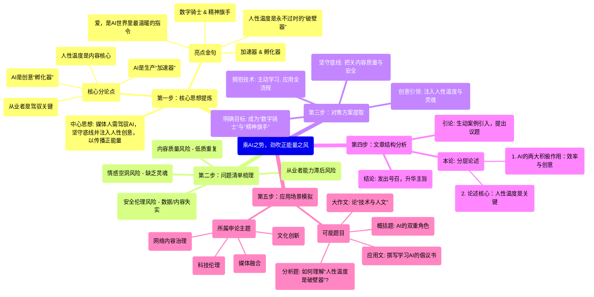

# 0326 乘AI之势，劲吹正能量之风

描绘气候变化带来的地表荒芜、海面上升等未来场景，《珍AI地球》以令人震撼的科幻效果提醒人们珍爱地球；“翩翩而来的画舫，细雨打湿了衣裳”，《当AI遇上乌镇》用人工智能为水乡江南写作一首动听的歌；“轴心时代”的东西方大哲何以对话，《当孔子遇见苏格拉底》制作数字人将今人畅想化作现实……

<!-- truncate -->

人工智能行业发展一日千里，为新闻内容生产带来怎样的机遇与挑战？回答相关问题，日前公布并展播的2024中国正能量网络传播AI精品案例提供了绝佳视角。相关作品充分展现了人工智能赋能网络正能量内容生产传播的创新做法、最新成效，对于拓宽AI应用的想象空间提供了启示。

随着语音交互、知识问答、图像生成等技术应用不断突破，人工智能的影响力版图不断拓展。从辅助编辑、生成摘要，到创作视频、制作海报，再到数字人主播，人工智能更深入地参与到网络作品生产传播过程中。一位从业者分享：原先创作视频花1个多月，现在只需5天。的确，信息聚合、字幕生成、自动剪辑、图片修复等功能，助力从业者高质高效制作图文视频等产品，大大减少重复性人工劳动和成本，提升作品时效性。

人工智能不仅是生产“加速器”，还是创意的“孵化器”。当憨态可掬的大熊猫成为奥运推荐官，当古朴典雅的瓷器自报家门、唱念做打，当人类的月球生活具体可感，相关展播作品内容生动活泼，让网友“冲浪”的体验愈发新奇绚丽。借助AI的翅膀，缺乏影像资料的历史画面、未来场景，也能可视化呈现；缺乏播音主持训练的作者，也能以多种形式“出镜”；根据个性化需求，能呈现各种艺术风格的复杂模态作品，有效提升艺术性。AI使网络作品形态多、表达新，有效增强受众体验感和参与感。

“爱，是AI世界里最温暖的指令。”从业者的使命，不仅在于守牢底线，在数据安全、内容质量上把好关，更在于创意引领，为内容注入灵魂。《AI重现志愿军年轻模样》，让泛黄照片动起来，一位位生命定格在美好年华的先烈露出笑容，不少读者表示：“看完已泪目”“盛世正如你们所愿”。此外，一批关于凡人微光、英雄赞歌等正能量作品也成功“破圈”。由此可见，人性温度是永不过时的“破壁器”，创意灵感是作品高人一筹的“关键招”。尽管AI可以“无线量产”，但受众并不喜欢低质重复；AI可以“无中生有”，但虚实结合才能引发共鸣。从业者充分发挥作用，才能让AI向善，更好传递正能量。

人工智能阔步向前，弄潮儿不能居于人后。站在时代风口浪尖，新闻工作者也要学成、用好新技术。在守住内容底线的基础上，大胆尝试、勇于创新，既着眼AI辅助内容生产，又关注产品分化推广评价等全流程，必将涌现更多驾驭技术的“数字骑士”与价值引领的“精神旗手”，不断激发互联网创新活力，以优质产品助力文化“活”起来、叙事“潮”起来、价值“留”下来。

好的，我们继续用这套方法来拆解这篇关于人工智能与正能量传播的文章。

---

### 文章拆解分析

#### **第一步：核心思想提炼**

* **一句话中心思想：**
    文章论述了新闻媒体行业应积极拥抱人工智能这一生产“加速器”和创意“孵化器”，同时必须坚守内容底线，并注入人性的温度与创意，让技术向善，从而更有效、更有力地传播网络正能量。

* **核心分论点：**
    * **总论点：** 人工智能为正能量内容生产传播带来巨大机遇，但从业者必须正确驾驭，方能兴利除弊。
    * **分论点1 (AI是生产加速器)：** AI技术能大幅提升内容生产的效率，降低时间与人工成本。
    * **分论点2 (AI是创意孵化器)：** AI能突破传统限制，实现丰富的可视化呈现和艺术表达，增强内容的吸引力与受众的体验感。
    * **分论点3 (人性温度是核心)：** 技术无法取代情感与灵魂；有温度、有共鸣的人性化内容和创意才是作品成功“破圈”的关键。
    * **分论点4 (从业者是关键)：** 新闻工作者需主动学习、勇于创新，坚守底线，发挥主导作用，成为驾驭技术的“数字骑士”和引领价值的“精神旗手”。

* **亮点/金句摘抄：**
    * “人工智能不仅是生产‘加速器’，还是创意的‘孵化器’。”
    * “爱，是AI世界里最温暖的指令。”
    * “人性温度是永不过时的‘破壁器’，创意灵感是作品高人一筹的‘关键招’。”
    * “尽管AI可以‘无线量产’，但受众并不喜欢低质重复；AI可以‘无中生有’，但虚实结合才能引发共鸣。”
    * “驾驭技术的‘数字骑士’与价值引领的‘精神旗手’。”

#### **第二步：问题清单梳理**

* **技术带来的挑战：** 人工智能行业飞速发展，给新闻内容生产带来了未知的机遇与挑战。
* **内容质量风险：** AI的“无限量产”能力可能导致低质量、重复性内容的泛滥。
* **情感空洞风险：** 完全由AI主导可能产生缺乏人性温度、无法引发情感共鸣的“空心”作品。
* **安全与伦理问题：** 存在数据安全、内容失实（虚实结合不当）等底线问题。
* **从业者能力滞后风险：** 新闻工作者如果不能及时学习和适应新技术，可能会被时代潮流抛在后面（“弄潮儿不能居于人后”）。

#### **第三步：对策方案提取**

* **对策一 (拥抱技术，提升效率)：**
    * **主动学习使用：** 新闻工作者要主动学习、用好新技术。
    * **应用到全流程：** 不仅用于内容生产，还要关注产品分化、推广、评价等全过程。

* **对策二 (坚守底线，确保安全)：**
    * **把好内容关：** 在数据安全、内容质量上守牢底线。
    * **追求真实共鸣：** 坚持虚实结合，避免凭空捏造，以引发受众共鸣。

* **对策三 (创意引领，注入灵魂)：**
    * **发挥人的主导作用：** 从业者要发挥创意引领作用，为内容注入灵魂。
    * **主打人性温度：** 创作关于凡人微光、英雄赞歌等充满人情味的内容，以此作为“破壁器”。
    * **大胆创新尝试：** 在守住底线的基础上，勇于尝试新形态、新表达。

* **对策四 (明确目标，引领价值)：**
    * **成为“数字骑士”：** 目标是成为能够熟练驾驭技术、勇于创新的专家。
    * **成为“精神旗手”：** 更重要的是成为能够引领正确价值观、让AI向善的旗手。

#### **第四步：文章结构分析**

* **引论 (案例引入)：** 开篇用《珍AI地球》《当AI遇上乌镇》等三个生动具体的AI应用案例，迅速吸引读者，直观展示AI在内容创作上的惊人潜力，并顺势提出“机遇与挑战”这一核心议题。
* **本论 (分层阐述)：**
    1.  首先，从工具层面分析AI的**两大积极作用**：作为“加速器”提升效率，以及作为“孵化器”激发创意。
    2.  然后，笔锋一转，深入到**精神内核层面**，强调技术不是万能的，人性温度和创意灵感才是作品成功的关键，并以《AI重现志愿军年轻模样》为例进行论证，深化了文章主旨。
* **结论 (发出号召)：** 在前文论述的基础上，向新闻工作者发出明确的号召。要求从业者既要掌握技术（成为“数字骑士”），又要引领价值（成为“精神旗手”），最终目标是以优质产品助力文化繁荣，实现社会价值。

#### **第五步：应用场景模拟**

* **可能出的题目：**
    * **概括题：** “请根据给定资料，概括人工智能在新闻内容生产中扮演的‘双重角色’及其内涵。”
    * **分析题：** “资料中提到‘人性温度是永不过时的“破壁器”’，请结合资料和实际，谈谈你对这句话在人工智能时代的理解。”
    * **对策题/应用文：** “假设你是一家媒体的新媒体部门负责人，请撰写一份内部倡议书，号召编辑记者们学习并利用AI技术，创作更多正能量网络精品。”
    * **大作文：** “请围绕‘技术与人文’的关系，结合给定资料，自选角度，自拟题目，写一篇文章。”

* **所属申论主题：**
    * 媒体融合与发展、网络内容建设与治理、科技伦理、文化创新、意识形态工作。

---

### 文章结构脑图 (Mermaid 格式)

