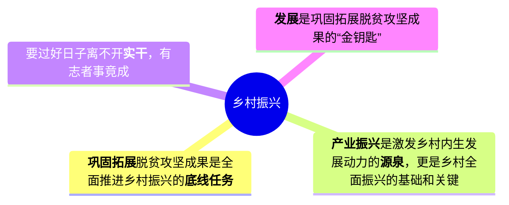

农业农村部近日在江西省赣州市召开巩固拓展脱贫攻坚成果工作推进会。会议指出，脱贫县农村居民人均可支配收入增速连续4年快于全国农村居民收入增速。这源于过渡期以来的接续帮扶，脱贫地区责任、政策、工作落地落实，帮扶产业持续发展壮大，脱贫劳动力务工就业规模稳中有增。

<!-- truncate -->

**巩固拓展脱贫攻坚成果是全面推进乡村振兴的底线任务**。2025年是巩固拓展脱贫攻坚成果同乡村振兴有效衔接5年过渡期的最后一年。相关地区和部门要毫不松懈抓好巩固拓展脱贫攻坚成果各项工作，提升防止返贫致贫监测帮扶效能，统筹建立农村防止返贫致贫机制和低收入人口、欠发达地区分层分类帮扶制度。在识别方面，要进一步优化监测机制，完善“一键报贫”等线上申报方式，强化部门筛查预警，充分发挥大数据比对和村基层组织作用，让数据多跑路、干部群众少跑腿。还要重点关注因病、因灾返贫等风险隐患，实现帮扶关口前移。对于有返贫致贫风险的农户，发现一个帮扶一个。做好应扶尽扶，避免返贫发生，动态消除风险。

**产业振兴是激发乡村内生发展动力的源泉，更是乡村全面振兴的基础和关键**。根据党中央以及国务院的部署要求，要“巩固一批、升级一批、盘活一批、调整一批”，促进帮扶产业高质量发展。要因地制宜选准优化产业方向，引育产业发展人才，提升设施装备条件，打造特色品牌。要用好管好帮扶项目资金，着力加强资产全链条监管，促进资产稳定良性运行。要发挥好东西部协作和中央单位定点帮扶作用，持续推进“万企兴万村”行动，促进脱贫地区产业健康发展，稳定提升脱贫劳动力务工就业质量及增收致富能力。

**要过好日子离不开实干，有志者事竟成**。帮扶工作还要把扶志与扶智结合起来，激发脱贫群众志气不能空泛，要助力其学技能长本事，“授人以渔”。结合劳务协作、就业帮扶车间等的实际需求，强化就业技能培训，让有关群众掌握一技之长，通过自身努力获得务工就业机会与发展空间。培养“造血”能力，加添信心志气，二者相辅相成，才能使脱贫群众脚下的路更宽。

**发展是巩固拓展脱贫攻坚成果的“金钥匙”**。要千方百计让脱贫地区和脱贫群众发展起来，通过发展带动帮扶，以帮扶促进发展，在推进乡村全面振兴中牢牢守住不发生规模性返贫致贫的底线。全社会共同努力，欠发达地区的风貌一定能不断提升改观，脱贫地区群众的生活水平一定能迈上新台阶。

---

**第一步：核心思想提炼**

* **一句话中心思想：**
    通过“扶志”与“扶智”相结合，激发脱贫群众的内生动力，并以产业发展为关键，全方位巩固脱贫攻坚成果，有效衔接乡村振兴。

* **核心分论点：**
    * **总论点：** 巩固拓展脱贫攻坚成果是全面推进乡村振兴的底线任务。
    * **分论点1 (监测帮扶)：** 提升防止返贫的监测帮扶效能是守住底线的重要保障。
    * **分论点2 (产业振兴)：** 发展高质量的帮扶产业是激发内生动力的源泉和关键。
    * **分论点3 (志智双扶)：** 将扶志与扶智相结合、培养“造血”能力是拓宽脱贫群众发展道路的核心举措。
    * **分论点4 (发展为要)：** 发展是巩固成果、解决问题的“金钥匙”。

* **亮点/金句摘抄：**
    * “扶志加扶智，让脱贫群众脚下路更宽” (可作标题)
    * “产业振兴是激发乡村内生发展动力的源泉，更是乡村全面振兴的基础和关键。”
    * “帮扶工作还要把扶志与扶智结合起来，激发脱贫群众志气不能空泛，要助力其学技能长本事，‘授人以渔’。”
    * “发展是巩固拓展脱贫攻坚成果的‘金钥匙’。”
    * “牢牢守住不发生规模性返贫致贫的底线。”

**第二步：问题清单梳理**

* **返贫风险问题：** 存在因病、因灾等返贫致贫的风险隐患。
* **监测机制问题：** 传统的监测方式可能不够高效，需要优化，让“数据多跑路、干部群众少跑腿”。
* **产业发展问题：** 部分帮扶产业可能存在质量不高、方向不准、后续监管不足等问题。
* **群众动力问题：** 部分脱贫群众可能存在志气不足、技能单一的问题，内生“造血”能力有待加强。

**第三步：对策方案提取**

* **监测帮扶层面：**
    * **优化监测机制：** 完善“一键报贫”等线上申报方式，强化部门筛查预警和大数据比对。
    * **前移帮扶关口：** 重点关注因病、因灾风险，做到早发现、早帮扶。
    * **落实应扶尽扶：** 对于风险农户，发现一个帮扶一个，动态消除风险。

* **产业发展层面：**
    * **优化产业布局：** 因地制宜选准优化产业方向，打造特色品牌。
    * **加强要素支持：** 引育产业人才，提升设施装备条件。
    * **强化资金监管：** 用好管好帮扶项目资金，加强资产全链条监管。
    * **汇聚社会合力：** 发挥东西部协作、中央单位定点帮扶和“万企兴万村”行动的作用。

* **个人能力层面 (志智双扶)：**
    * **强化技能培训：** 结合劳务协作和就业车间需求，让群众掌握一技之长。
    * **激发内生动力：** 通过“授人以渔”的方式，培养“造血”能力，增添信心志气。

**第四步：文章结构分析**

* **提出背景/肯定成绩 (引论)：** 开篇指出脱贫县收入增速快于全国，肯定了接续帮扶的成效。
* **分析任务/提出对策 (本论)：**
    1.  从“守住底线”角度，提出要**提升监测帮扶效能**。
    2.  从“内生动力”角度，论述**产业振兴**是关键，并提出具体举措。
    3.  从“个人发展”角度，强调**扶志扶智相结合**的核心作用。
* **总结升华/发出号召 (结论)：** 最后用“发展是金钥匙”进行总结，并号召全社会共同努力，展望美好未来。

**第五步：应用场景模拟**

* **可能出的题目：**
    * **概括题：** “请根据给定资料，概括当前在巩固拓展脱贫攻坚成果方面需要重点关注的几个问题。”
    * **对策题：** “假如你是某县乡村振兴局的工作人员，请就如何‘扶志扶智相结合，激发群众内生动力’提出具体建议。”
    * **大作文：** “请结合你对‘发展是巩固拓展脱贫攻坚成果的金钥匙’这句话的理解，自选角度，自拟题目，写一篇文章。”
* **所属申论主题：**
    * 乡村振兴、民生保障、基层治理、共同富裕。