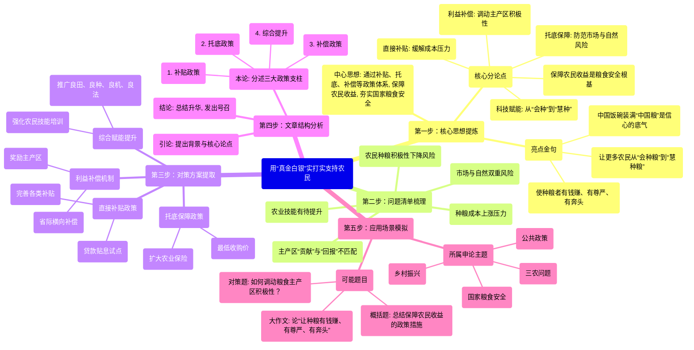

## 用“真金白银”实打实支持农民

- 第一步：核心思想提炼
  - 中心思想: 通过补贴、托底、补偿等政策体系, 保障农民收益, 夯实国家粮食安全
  - 核心分论点
    - 保障农民收益是粮食安全根基
    - 直接补贴: 缓解成本压力
    - 托底保障: 防范市场与自然风险
    - 利益补偿: 调动主产区积极性
    - 科技赋能: 从“会种”到“慧种”
  - 亮点金句
    - 使种粮者有钱赚、有尊严、有奔头
    - 中国饭碗装满“中国粮”是信心的底气
    - 让更多农民从“会种粮”到“慧种粮”
- 第二步：问题清单梳理
  - 农民种粮积极性下降风险
  - 种粮成本上涨压力
  - 市场与自然双重风险
  - 主产区“贡献”与“回报”不匹配
  - 农业技能有待提升
- 第三步：对策方案提取
  - 直接补贴政策
    - 完善各类补贴
    - 贷款贴息试点
  - 托底保障政策
    - 最低收购价
    - 扩大农业保险
  - 利益补偿机制
    - 省际横向补偿
    - 奖励主产区
  - 综合赋能提升
    - 推广良田、良种、良机、良法
    - 强化农民技能培训
- 第四步：文章结构分析
  - 引论: 提出背景与核心论点
  - 本论: 分述三大政策支柱
    - 1. 补贴政策
    - 2. 托底政策
    - 3. 补偿政策
    - 4. 综合提升
  - 结论: 总结升华, 发出号召
- 第五步：应用场景模拟
  - 可能题目
    - 概括题: 总结保障农民收益的政策措施
    - 对策题: 如何调动粮食主产区积极性？
    - 大作文: 论“让种粮有钱赚、有尊严、有奔头”
  - 所属申论主题
    - 国家粮食安全
    - 乡村振兴
    - 三农问题
    - 公共政策

春分前后，春耕春播在祖国大地由南向北全面展开。

农业农村部信息显示：今年国家继续实施耕地地力保护补贴、稻谷补贴，以及东北玉米大豆生产者补贴等政策，启动实施粮油种植专项贷款贴息试点、东北大豆种子包衣补助，打出支持粮食和大豆生产政策组合拳，为实现粮食产量1.4万亿斤左右目标提供有力保障。

<!-- truncate -->

农民种粮积极性高不高，关乎国家粮食安全。今年政府工作报告明确，完善强农惠农富农支持制度，千方百计推动农业增效益、农村增活力、农民增收入。切实保障农民种粮收益，才能保护农民种粮积极性，进一步夯实粮食安全根基。

完善落实补贴政策，为种粮实实在在加油。今年中央一号文件明确，完善玉米大豆生产者补贴、稻谷补贴政策，稳定耕地地力保护补贴政策。同时，鼓励地方开展粮油种植专项贷款贴息试点。国家用“真金白银”鼓励种粮，缓解种粮成本上涨压力，给农民实打实的支持。

确保托底有力有效，减少农民后顾之忧。落实稻谷、小麦最低收购价政策，有序做好粮食收购，稳定市场价格，防止谷贱伤农，维护农民利益。降低产粮大县农业保险县级保费补贴承担比例，推动扩大稻谷、小麦、玉米、大豆完全成本保险和种植收入保险投保面积，帮助农民提高防范自然灾害风险、抵御市场风险的能力。

实施利益补偿机制，增强粮食主产区干劲。健全粮食主产区奖补激励制度，启动实施中央统筹下的粮食产销区省际横向利益补偿机制，通过“受益”省份出资、“贡献”省份获得补偿的方式，加大对粮食主产区和产粮大县支持。逐步扩大产粮大县公共服务能力提升行动实施范围。让种粮贡献匹配应有回报，让粮食主产区真正得实惠，进一步调动地方抓粮积极性。

有力落实补贴、托底、补偿“多位一体”的保障政策体系，组合拳可发挥乘数效应。此外，还要继续加大良田、良种、良机、良法推广力度，在精耕细作上下功夫；强化农民技能培训，让更多农民从“会种粮”到“慧种粮”。

端牢中国饭碗，必须多种粮、种好粮。呵护农民种粮热情，要做实实在在、有利于种粮的事，切实维护种粮农民权益，使种粮者有钱赚、有尊严、有奔头。春华秋实，每一片耕地都会成为孕育丰收的希望田野，每一颗果实都将成为筑牢粮食安全的基石保障。中国饭碗装满“中国粮”，更是我们沉着应对各种风险挑战的信心底气。

---

## 文章拆解分析

### **第一步：核心思想提炼**

* **一句话中心思想：**
    文章论述了为夯实国家粮食安全根基，国家必须通过补贴、托底、补偿等“真金白银”的政策组合拳，切实保障农民种粮收益，并结合科技与技能提升，全面激发农民和粮食主产区的积极性。

* **核心分论点：**
    * **总论点：** 保障农民种粮收益是保护其种粮积极性、夯实国家粮食安全的根本。
    * **分论点1 (直接补贴)：** 完善并落实直接补贴政策，是缓解种粮成本上涨压力、为农民加油的直接手段。
    * **分论点2 (托底保障)：** 通过最低收购价和农业保险等政策，为农民提供有效的风险托底，减少其后顾之忧。
    * **分论点3 (利益补偿)：** 建立对粮食主产区的利益补偿机制，能有效调动地方政府抓好粮食生产的积极性。
    * **分论点4 (综合赋能)：** 政策保障之外，还需通过推广良法良技和加强技能培训，让农民从“会种粮”转向“慧种粮”。

* **亮点/金句摘抄：**
    * “切实保障农民种粮收益，才能保护农民种粮积极性，进一步夯实粮食安全根基。”
    * “让种粮贡献匹配应有回报，让粮食主产区真正得实惠，进一步调动地方抓粮积极性。”
    * “让更多农民从‘会种粮’到‘慧种粮’。”
    * “使种粮者有钱赚、有尊严、有奔头。”
    * “中国饭碗装满‘中国粮’，更是我们沉着应对各种风险挑战的信心底气。”

### **第二步：问题清单梳理**

* **农民积极性问题：** 种粮收益若无保障，农民积极性会受挫，进而影响国家粮食安全。
* **生产成本问题：** 种粮成本持续上涨，对农民收益造成直接压力。
* **多重风险问题：** 农民面临市场价格波动的风险（“谷贱伤农”）和自然灾害风险。
* **区域发展问题：** 粮食主产区承担了保障粮食安全的重任，但其经济回报和公共服务能力可能与贡献不匹配，影响地方抓粮积极性。
* **技能水平问题：** 传统耕作方式效率有待提升，农民需要掌握更先进的农业技术和方法。

### **第三步：对策方案提取**

* **补贴层面（直接加油）：**
    * **完善补贴政策：** 落实耕地地力保护补贴、稻谷补贴、玉米大豆生产者补贴。
    * **创新金融支持：** 开展粮油种植专项贷款贴息试点。
    * **精准支持特定作物：** 如东北大豆种子包衣补助。

* **托底层面（减少担忧）：**
    * **价格托底：** 落实稻谷、小麦最低收购价政策，稳定市场。
    * **风险托底：** 扩大稻谷、小麦、玉米、大豆完全成本保险和种植收入保险的覆盖面，并降低产粮大县保费承担比例。

* **补偿层面（激发干劲）：**
    * **建立补偿机制：** 启动粮食产销区省际横向利益补偿机制（“受益”省份补偿“贡献”省份）。
    * **强化激励制度：** 健全对粮食主产区的奖补激励。
    * **提升公共服务：** 扩大产粮大县公共服务能力提升行动的实施范围。

* **综合赋能层面：**
    * **技术推广：** 加大良田、良种、良机、良法推广力度。
    * **技能培训：** 强化农民技能培训，实现从“会种粮”到“慧种粮”的转变。

### **第四步：文章结构分析**

* **引论 (提出观点)：** 以“春耕”为背景切入，引出国家支持粮食生产的系列政策，并直接点明核心论点——保障农民收益是夯实粮食安全根基的关键。
* **本论 (分层论述)：** 结构清晰，采用并列结构，从三个核心层面展开论述国家的政策“组合拳”：
    1.  **完善落实补贴政策**（直接给钱）
    2.  **确保托底有力有效**（规避风险）
    3.  **实施利益补偿机制**（激励地方）
    随后，将三者整合为“多位一体”的保障体系，并补充了“科技赋能”这一重要维度，使论述更全面。
* **结论 (总结升华)：** 重申保障农民权益的重要性，将目标从“有钱赚”提升到“有尊严、有奔头”的精神层面，最后将“中国饭碗”与国家应对风险挑战的“信心底气”相关联，立意高远，发出号召。

### **第五步：应用场景模拟**

* **可能出的题目：**
    * **概括题：** “请根据给定资料，概括我国为保障农民种粮收益采取了哪些主要措施。”
    * **对策题：** “给定资料提到‘让种粮贡献匹配应有回报’，请就如何进一步调动粮食主产区积极性，谈谈你的看法和建议。”
    * **大作文：** “请从‘使种粮者有钱赚、有尊严、有奔头’这句话中获得启示，结合社会实际，自选角度，自拟题目，写一篇文章。”

* **所属申论主题：**
    * 国家粮食安全、三农问题（农业、农村、农民）、乡村振兴、公共政策制定、区域协调发展。

---

## 文章结构脑图 (Mermaid 格式)

