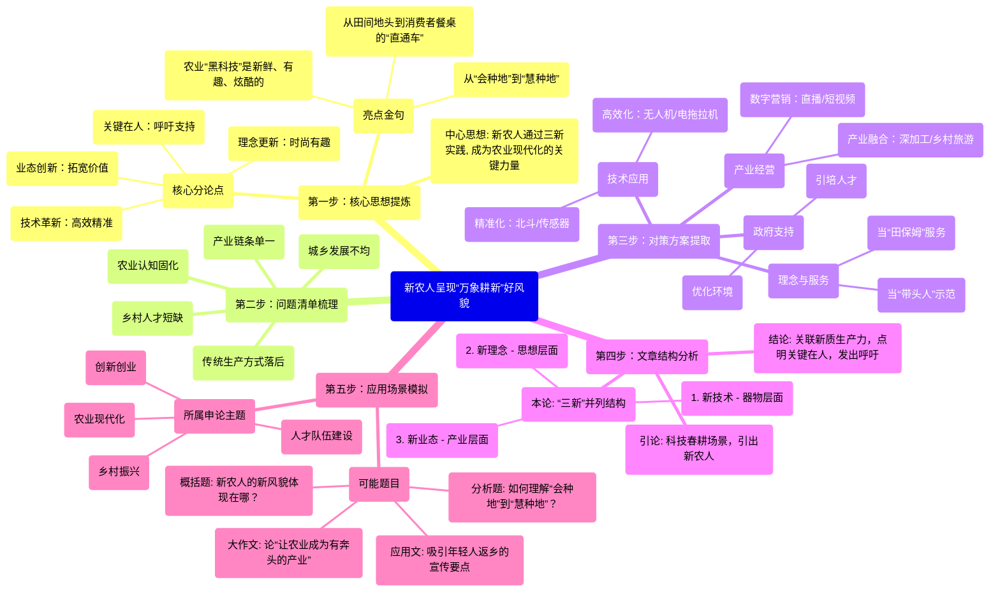

# 新农人呈现“万象耕新”好风貌

- 第一步：核心思想提炼
  - 中心思想: 新农人通过三新实践, 成为农业现代化的关键力量
  - 核心分论点
    - 技术革新：高效精准
    - 理念更新：时尚有趣
    - 业态创新：拓宽价值
    - 关键在人：呼吁支持
  - 亮点金句
    - 从“会种地”到“慧种地”
    - 农业“黑科技”是新鲜、有趣、炫酷的
    - 从田间地头到消费者餐桌的“直通车”
- 第二步：问题清单梳理
  - 传统生产方式落后
  - 乡村人才短缺
  - 农业认知固化
  - 产业链条单一
  - 城乡发展不均
- 第三步：对策方案提取
  - 技术应用
    - 精准化：北斗/传感器
    - 高效化：无人机/电拖拉机
  - 理念与服务
    - 当“带头人”示范
    - 当“田保姆”服务
  - 产业经营
    - 数字营销：直播/短视频
    - 产业融合：深加工/乡村旅游
  - 政府支持
    - 引培人才
    - 优化环境
- 第四步：文章结构分析
  - 引论: 科技春耕场景，引出新农人
  - 本论: “三新”并列结构
    - 1. 新技术 - 器物层面
    - 2. 新理念 - 思想层面
    - 3. 新业态 - 产业层面
  - 结论: 关联新质生产力，点明关键在人，发出呼吁
- 第五步：应用场景模拟
  - 可能题目
    - 概括题: 新农人的新风貌体现在哪？
    - 分析题: 如何理解“会种地”到“慧种地”？
    - 应用文: 吸引年轻人返乡的宣传要点
    - 大作文: 论“让农业成为有奔头的产业”
  - 所属申论主题
    - 乡村振兴
    - 农业现代化
    - 人才队伍建设
    - 创新创业

<!-- truncate -->

## 文章拆解分析

### **第一步：核心思想提炼**

  * **一句话中心思想：**
    文章通过描绘新农人运用新技术、新理念、新业态的生动实践，论证了他们是发展农业新质生产力、推进农业现代化的关键力量，并呼吁社会为这支乡村人才队伍的成长提供更好的支持。

  * **核心分论点：**

      * **总论点：** 以“90后”“00后”为代表的新农人，正以全新的风貌为“三农”发展注入强大活力。
      * **分论点1 (技术革新)：** 新农人善用北斗、无人机、物联网等“黑科技”，实现了农业生产的精准、高效、低成本，让春耕更具“科技范”。
      * **分论点2 (理念更新)：** 新农人改变了“面朝黄土，背朝天”的传统观念，视智慧农业为“有趣、炫酷”的广阔舞台，并担当“带头人”和“田保姆”，带动周边农户共同进步。
      * **分论点3 (业态创新)：** 作为“农创客”，新农人将互联网与农业深度融合，通过直播电商、品牌打造和乡村旅游，极大地拓展了乡村产业的价值链和发展空间。
      * **最终落点 (人才关键)：** 农业现代化的所有目标，关键都在于人。必须大力培养和支持新农人，让他们在乡村振兴的大舞台上建功立业。

  * **亮点/金句摘抄：**

      * “新农人呈现‘万象耕新’好风貌。”
      * “带动更多农户从‘会种地’到‘慧种地’。”
      * “在年轻的新农人看来，农业‘黑科技’是新鲜的、有趣的、炫酷的。”
      * “形成从田间地头到消费者餐桌的‘直通车’。”
      * “实现有关目标，关键在人。”

### **第二步：问题清单梳理**

文章主要以正面论述为主，通过新农人的成功实践来反衬出需要解决的传统农业问题：

  * **传统生产方式问题：** 传统农业依赖人工，效率低、成本高、浪费大，亟需现代化转型。
  * **乡村人才短缺问题：** 农业农村发展面临人才流失和老龄化挑战，迫切需要有知识、有活力、懂技术的新鲜血液。
  * **农业认知固化问题：** 社会上存在农业是“苦、累、旧”的刻板印象，难以吸引年轻人投身其中。
  * **产业链条单一问题：** 传统农业附加值低，销售渠道不畅，农产品价值未能充分实现。
  * **城乡发展不均问题：** 乡村的优质资源和环境价值未被充分挖掘，需要新业态来盘活。

### **第三步：对策方案提取**

文章主要通过描述新农人的行为来展现对策，这些行为本身就是解决问题的方案：

  * **技术应用层面：**

      * **精准化：** 应用北斗导航、土壤墒情传感器等，实现精准播种、科学施肥。
      * **高效化：** 使用无人机、电动拖拉机、移动补能车等新装备，提高作业效率，降低成本。

  * **理念与服务层面：**

      * **示范引领：** 担当“带头人”，推广新技术、新装备。
      * **社会化服务：** 创建农事服务中心，当好“田保姆”，为其他农户提供全方位托管服务。

  * **产业经营层面：**

      * **数字营销：** 通过直播、短视频等方式打造农产品品牌，打开销路。
      * **产业融合：** 发展农产品深加工和乡村旅游，提高综合效益，带动共同富裕。

  * **政府支持层面（文章结尾的呼吁）：**

      * **加大人才引培：** 地方政府应加大对农业人才的培养和引进力度。
      * **优化创业环境：** 为新农人、农创客营造良好的创新创业环境，助力其扎根成长。

### **第四步：文章结构分析**

  * **引论 (描绘新貌)：** 以春耕为场景，用一系列“高科技”务农画面开篇，直接引出文章主角——新农人，并点出其“万象耕新”的好风貌。
  * **本论 (三新并举)：** 结构极其清晰，采用“三新”并列的结构，从三个维度层层递进地展开论述：
    1.  **新技术：** 聚焦于“器物”层面，讲新农人如何利用科技装备提升生产效率。
    2.  **新理念：** 上升到“思想”层面，讲新农人如何改变传统观念并影响他人。
    3.  **新业态：** 拓展到“产业”层面，讲新农人如何创新商业模式，拓宽发展空间。
  * **结论 (点明关键，发出呼吁)：** 将新农人的实践与“新质生产力”的国家战略相结合，点明“关键在人”的核心，并向地方政府发出呼吁，要求为人才成长创造良好环境，有力地收束全文并升华主题。

### **第五步：应用场景模拟**

  * **可能出的题目：**

      * **概括题：** “请根据给定资料，概括‘新农人’呈现出的新风貌主要体现在哪些方面？”
      * **分析题：** “资料中提到，新农人带动了‘从“会种地”到“慧种地”’的转变。请谈谈你对这一转变的理解。”
      * **对策题/应用文：** “假如你是某地农业农村局的工作人员，请为吸引更多年轻人返乡成为‘新农人’，草拟一份宣传工作要点。”
      * **大作文：** “请结合你对‘让农业成为有奔头的产业，让农民成为有吸引力的职业’的理解，自选角度，自拟题目，写一篇文章。”

  * **所属申论主题：**

      * 乡村振兴、农业现代化、人才队伍建设、创新创业、新质生产力。

-----

## 文章结构脑图 (Mermaid 格式)

---

用北斗为播种导航、借助无人机施肥打药、通过土壤墒情传感器精确测算肥料需求……随着气温转暖，各地陆续进入春耕，越来越多新农人运用现代技术和科技装备，呈现“万象耕新”好风貌。

农业现代化关乎粮食安全，应用推广农业高新技术需要掌握新知的新农人。今年政府工作报告提出“加快先进适用农机装备研发应用和农业科技成果大面积推广”，部署“壮大乡村人才队伍”。可喜的是，一些年轻人正带着新技术、新装备、新理念投身希望的田野，为“三农”注入科技新活力、增收新动力。

新技术，让春耕事半功倍。借助北斗智能终端，播种机可实现每千米误差在厘米级的精准播种，并且种子、化肥、滴灌带可同时埋入土壤，每天能播种上百亩。运用土壤墒情传感器，能精确测算土壤肥料需求，实现科学合理施肥，减少农资浪费。纯电动拖拉机充一次电能工作四五个小时，比柴油拖拉机省钱环保，移动补能车5分钟即可完成电池更换，保证农忙作业不停歇……农业新技术与新装备，被越来越多新农人“玩转”，繁忙的春耕更有“科技范”，提高效率不误农时，规模化作业降低成本。

新理念，让耕作变得很“潮”。新农人中不乏“90后”“00后”，他们不再“面朝黄土，背朝天”，而是乐于学习、掌握、应用农业新知，甚至自己就是农科、机械专业毕业的大学生。有人当起“带头人”，积极推广新技术新装备，带动更多农户从“会种地”到“慧种地”。有人当起“田保姆”，创建农事服务中心，运用现代农机，为农户提供机耕、机插、机防、机收等全方位服务。在年轻的新农人看来，农业“黑科技”是新鲜的、有趣的、炫酷的，智慧农业蕴含广阔前景。

新业态，让乡村天地更宽广。农创客积极融入互联网，直播绿色农业，打造“爆款”短视频，让更多人了解当地优质特色农产品。积累品牌效应，结合深加工，提高附加值，再通过电商物流，形成从田间地头到消费者餐桌的“直通车”。通过网络传播，乡村山清水秀的环境、清新芬芳的氛围，令不少人神往。在有关部门的支持下，农创客整合乡村旅游资源，带动更多农民增收，助力乡村全面振兴。

今年中央一号文件提出，“以科技创新引领先进生产要素集聚，因地制宜发展农业新质生产力”。实现有关目标，关键在人。年轻的新农人展现出朝气、创新、干劲，为“三农”发展加添新活力。地方有关部门应当进一步加大农业人才培养和引才力度，营造农业创新创业的良好环境，助力新农人、农创客在梦想的沃土扎根，茁壮成长。