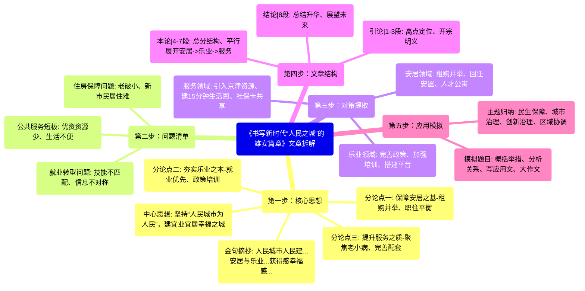

# 书写新时代“人民之城”的雄安篇章

- 第一步：核心思想
  - 中心思想: 坚持“人民城市为人民”，建宜业宜居幸福之城
  - 分论点一: 保障安居之基(租购并举、职住平衡)
  - 分论点二: 夯实乐业之本(就业优先、政策培训)
  - 分论点三: 提升服务之质(聚焦老小病、完善配套)
  - 金句摘抄: 人民城市人民建...安居与乐业...获得感幸福感...
- 第二步：问题清单
  - 住房保障问题(老破小、新市民居住难)
  - 就业转型问题(技能不匹配、信息不对称)
  - 公共服务短板(优资资源少、生活不便)
- 第三步：对策提取
  - 安居领域: 租购并举、回迁安置、人才公寓
  - 乐业领域: 完善政策、加强培训、搭建平台
  - 服务领域: 引入京津资源、建15分钟生活圈、社保卡共享
- 第四步：文章结构
  - 引论(1-3段): 高点定位、开宗明义
  - 本论(4-7段): 总分结构、平行展开安居->乐业->服务
  - 结论(8段): 总结升华、展望未来
- 第五步：应用模拟
  - 模拟题目: 概括举措、分析关系、写应用文、大作文
  - 主题归纳: 民生保障、城市治理、创新治理、区域协调

<!-- truncate -->

雄安新区，设立8周年。

从蓝图初绘，到拔节生长，雄安的变化，不仅体现在一幢幢现代化建筑拔地而起、高质量绿色发展初见雏形，更体现在人民群众生活更加红火、日子更有奔头。

从数以万计的群众喜迁新居，到千方百计让群众端稳就业饭碗，再到优质教育和医疗资源陆续汇集……这背后，是雄安牢记习近平总书记“人民城市人民建，人民城市为人民”的殷殷嘱托，坚决贯彻落实党中央关于建设雄安新区的战略部署，实施“绣花功夫”般的精细化治理，推进“京雄同城化”的优质高效公共服务创新，一步步勾勒出新时代宜业宜居“人民之城”的清晰模样。

安居乐业，是人民群众最素朴的愿望。2023年5月10日，习近平总书记在河北省雄安新区考察时指出：“建设好雄安新区，重要的是衔接好安居和乐业，让群众住得稳、过得安、有奔头。”这是人民领袖的深情牵挂，更为雄安建设发展指明方向。

创新性实施租购并举，使“租购同权”成为现实。科学规划并推行职住平衡，让居民就近工作成为可能。回迁安置有序推进，居民告别“老破小”，搬进宽敞明亮新楼房，安置小区环境优美、配套完善。政府持有人才公寓，让初到雄安的各类才俊放下行囊、轻松入住……雄安在居住保障方面的不懈努力，体现在一个个百姓安居的温馨故事中。

针对群众就业，习近平总书记明确：“要坚持就业优先，完善就业创业引导政策，加强对新区劳动力的再就业培训。”8年里，来雄安投资创业的社会资本和民营企业逐渐聚能成势，多种经营主体在带来高质量发展新动能的同时，用人需求也在不断增加。雄安有关部门实施“月月有招聘活动、周周有直播带岗、时时有就业服务”，积极做好桥梁保障。对于重点就业群体，组织开展技能培训、订单式培训，持续为群众建设“家门口就业服务站”。雄安是创新创业乐土，也是安居乐业福地。

让人民群众过上好日子，更要不断完善公共服务体系。聚焦“一小”，北京四中雄安校区、雄安史家胡同小学、雄安北海幼儿园顺利开学，为群众提供更多优质教育资源。关注“一老”，雄安重点建设老年幸福型城市，推进示范性老年幸福型社区创建，打造多层次多样化养老服务场景。着眼“瞧病”，雄安宣武医院开诊，北京医务人员积极支援，提升新区疾病救治能力和医疗服务水平。“雄安一卡通”社保卡实现就医购药、人社服务、公共交通等“京雄共享”。围绕“便民利民”，打造“15分钟便民生活圈”，配置公园、超市、学校、卫生服务站、文化活动站、社区食堂、养老驿站等一系列公共服务设施。持续提升住有所居、劳有所得、幼有所教、病有所医、老有所养等公共服务保障能力，“人民之城”的底色更足。

“让人民群众从新区建设发展中感受到实实在在的获得感、幸福感。”对雄安而言，这是使命鞭策，更是久久为功的动力。大力推动儿童友好、青年发展型、老年幸福型城市建设，在进取中改善和保障民生，在创新中提升城市治理水平，在协同中促进区域均衡发展，雄安必将绘就更加宜业宜居、和谐美好的幸福画卷，书写新时代“人民之城”的璀璨篇章。

好的，我们来拆解分析这篇文章——《书写新时代“人民之城”的雄安篇章》。

这是一篇非常典型的官媒正面宣传文章，结构清晰、立意高远、表述规范，极具学习和模仿价值。

-----

### 文章深度拆解

#### **第一步：核心思想提炼 (定主题、抓总分)**

  * **一句话中心思想：**
    雄安新区始终坚持“人民城市为人民”的核心理念，通过在安居、乐业、公共服务等关键领域实施精细化治理和创新举措，致力于建设新时代宜业宜居的幸福之城。

  * **核心分论点 (3个)：**

    1.  **抓牢“安居”之基：** 通过租购并举、职住平衡、回迁安置、人才公寓等多元化措施，全力保障群众住有所居、居有所安。
    2.  **夯实“乐业”之本：** 坚持就业优先，通过政策引导、平台搭建、技能培训等方式，千方百计促进群众稳定就业、高质量就业。
    3.  **提升“服务”之质：** 聚焦“一老一小一病”和生活便利，大力引进优质资源、完善配套设施，全面提升公共服务水平，增强人民群众的获得感与幸福感。

  * **亮点/金句摘抄：**

    1.  **权威引语 (立意之源)：** 人民城市人民建，人民城市为人民。
    2.  **权威引语 (实践方向)：** 建设好雄安新区，重要的是衔接好安居和乐业，让群众住得稳、过得安、有奔头。
    3.  **高度概括 (价值体现)：** 让人民群众从新区建设发展中感受到实实在在的获得感、幸福感。
    4.  **排比句 (结尾升华)：** 在进取中改善和保障民生，在创新中提升城市治理水平，在协同中促进区域均衡发展。
    5.  **形象比喻 (工作方法)：** 实施“绣花功夫”般的精细化治理。

#### **第二步：问题清单梳理 (找问题、析原因)**

这篇文章是正面报道，没有直接罗列问题，但其所有对策都旨在解决特定挑战。我们可以从对策反推其针对的问题：

1.  **问题：城市建设初期的居民住房保障问题。**

      * **表现：** 原有住房条件差（老破小）、新迁入人才的居住难题、购房压力大、职住分离可能导致的交通拥堵和生活不便。

2.  **问题：城市产业转型升级中的群众就业匹配与保障问题。**

      * **表现：** 新区产业结构更新，原有居民的劳动技能可能不匹配；重点群体（如回迁居民）的就业面临挑战；信息不对称导致招工难和找工作难。

3.  **问题：新建城市公共服务资源短缺与水平不高的问题。**

      * **表现：** 缺乏优质的教育、医疗资源；养老服务体系不健全；跨区域（京雄）办事、就医存在壁垒；日常生活配套设施不足，影响生活便利性。

#### **第三步：对策方案提取 (抄对策、学表述)**

**维度一：按“民生领域”分类**

  * **居住保障 (安居)：**

      * 实施租购并举（实现租购同权）。
      * 科学规划职住平衡。
      * 有序推进回迁安置。
      * 政府提供人才公寓。

  * **就业促进 (乐业)：**

      * 完善就业创业引导政策。
      * 加强劳动力再就业培训。
      * 搭建常态化招聘平台（月月有招聘、周周有直播）。
      * 建设“家门口就业服务站”。
      * 组织开展技能培训、订单式培训。

  * **公共服务 (惠民)：**

      * **教育：** 引入（北京）优质教育资源。
      * **医疗：** 引入（北京）优质医疗资源，提升本地救治能力。
      * **养老：** 建设老年幸福型城市，创建示范性社区，打造多样化养老场景。
      * **便利生活：** 打造“15分钟便民生活圈”，配置各类公共服务设施。
      * **区域协同：** 推行社保卡“京雄共享”（就医购药、交通等）。

**维度二：按“治理方式”分类**

  * **制度创新：**
      * 创新实施租购并举、租购同权。
      * 推进“京雄同城化”公共服务创新。
  * **精细化治理：**
      * 实施“绣花功夫”般治理。
      * 建设“家门口就业服务站”。
      * 打造“15分钟便民生活圈”。
  * **平台化服务：**
      * 搭建线上线下招聘平台。
      * 利用“雄安一卡通”整合多项服务。

#### **第四步：文章结构分析 (学逻辑、仿行文)**

  * **引论 (第1-3段)：** **高点定位，开宗明义。**

      * 以“设立8周年”为契机切入，点明雄安的“拔节生长”。
      * 立即拔高立意，引出“人民城市为人民”的核心指导思想和习近平总书记的殷殷嘱托，确立了全文的总纲和理论高度。

  * **本论 (第4-7段)：** **总分结构，平行展开。**

      * 文章以“安居乐业”为总领，然后分领域阐述。
      * **第4-5段：** 聚焦“安居”，从租、购、迁、引（人才）四个角度阐述如何解决居住问题。
      * **第6段：** 聚焦“乐业”，从政策、培训、平台三个层面阐述如何保障就业。
      * **第7段：** 聚焦“公共服务”，围绕“一小、一老、瞧病、便民”四个方面，具体论述如何完善服务体系。
      * **逻辑递进关系：** 整个本论部分遵循了“安居（基础）→乐业（发展）→优质公共服务（幸福感提升）”的逻辑链条，层层递进，结构非常清晰、严谨。

  * **结论 (第8段)：** **总结升华，展望未来。**

      * 重申“获得感、幸福感”的目标，回应开头。
      * 用“在进取中...在创新中...在协同中...”高度凝练地总结了实现路径和发展方向。
      * 最后以“必将绘就...璀璨篇章”的豪迈语句收尾，展望美好未来，升华了文章主题。

#### **第五步：应用场景模拟 (转知识、为我用)**

  * **模拟出题：**

    1.  **概括题：** 根据“给定资料”，请概括雄安新区在践行“人民城市为人民”理念方面所采取的主要举Cua。
    2.  **综合分析题：** “给定资料”中提到，“建设好雄安新区，重要的是衔接好安居和乐业”。请结合你对这句话的理解，谈谈“安居”与“乐业”的辩证关系。
    3.  **应用文写作题：** 假设你是某新区管委会的工作人员，请借鉴雄安新区的经验，就如何“打造15分钟便民生活圈，提升居民幸福感”撰写一份工作方案要点。
    4.  **大作文（申论文章）：** 请深入思考“给定资料”，以“以‘人’为本，雕琢城市幸福底色”为主题，自拟题目，写一篇文章。

  * **主题归纳：**

      * **核心主题：** 民生保障、城市建设与治理、创新社会治理。
      * **相关主题：** 区域协调发展（京雄协同）、高质量发展、人才工作。

-----

### 文章拆解思维导图

