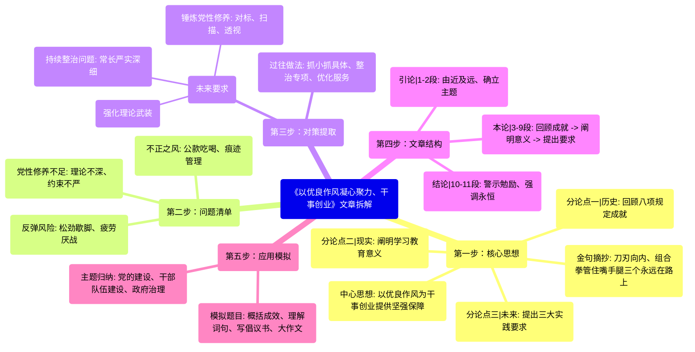

# 以优良作风凝心聚力、干事创业

- 第一步：核心思想
  - 中心思想: 以优良作风为干事创业提供坚强保障
  - 分论点一 (历史): 回顾八项规定成就
  - 分论点二 (现实): 阐明学习教育意义
  - 分论点三 (未来): 提出三大实践要求
  - 金句摘抄: 刀刃向内、组合拳管住嘴手腿三个永远在路上
- 第二步：问题清单
  - 不正之风(公款吃喝、痕迹管理)
  - 反弹风险(松劲歇脚、疲劳厌战)
  - 党性修养不足(理论不深、约束不严)
- 第三步：对策提取
  - 过往做法: 抓小抓具体、整治专项、优化服务
  - 未来要求
    - 强化理论武装
    - 持续整治问题(常长严实深细)
    - 锤炼党性修养(对标、扫描、透视)
- 第四步：文章结构
  - 引论(1-2段): 由近及远、确立主题
  - 本论(3-9段): 回顾成就 -> 阐明意义 -> 提出要求
  - 结论(10-11段): 警示勉励、强调永恒
- 第五步：应用模拟
  - 模拟题目: 概括成效、理解词句、写倡议书、大作文
  - 主题归纳: 党的建设、干部队伍建设、政府治理

<!-- truncate -->

---

近日，习近平总书记在贵州考察时指出：“党中央决定在全党开展深入贯彻中央八项规定精神学习教育，这是今年党建工作的重点任务。”不久前，中共中央办公厅印发《关于在全党开展深入贯彻中央八项规定精神学习教育的通知》，学习教育于2025年全国两会后启动、7月底前基本结束。

时间回溯到2012年12月4日，党的十八大闭幕不到一个月，中共中央政治局审议通过关于改进工作作风、密切联系群众的八项规定。从立规矩开始，从作风建设切入，从人民群众最深恶痛绝、对党的形象损害最大的地方着手……党的十八大以来，以习近平同志为核心的党中央以中央八项规定精神为动员令，吹响了新时代全面从严治党的号角。

刀刃向内，亮出“杀手锏”。从公款吃喝等具体问题抓起，从月饼、粽子等身边小事查起，从“舌尖上的浪费”“车轮上的腐败”“会所里的歪风”等不正之风整治起，刹住了一些长期没有刹住的歪风，纠治了一些多年未除的顽瘴痼疾。

动真碰硬，树起“铁规矩”。有干部总结，“管住嘴，不该吃的坚决不吃、不该说的坚决不说；管住手，不该拿的坚决不拿、不该动的坚决不动；管住腿，不该去的坚决不去、不该进的坚决不进。”中央八项规定的铁规矩、硬杠杠，“威力”可见一斑。

谋深虑远，打出“组合拳”。基层干部从“痕迹管理”中解放，更多精力投入实际工作，干事创业精气神更足；从“进一门”到“最多跑一次”，从“不见面”到“一网通办”，再到“高效办成一件事”，经营主体轻装前行……党风政风、民风社风为之一新，干群关系、治理效能持续向好。

身处奋进新征程的关键时期，在全党开展深入贯彻中央八项规定精神学习教育，是持之以恒推进全面从严治党的再宣示，也是深入推进新时代党的建设新的伟大工程的再动员。

以这次学习教育为契机，我们要强化理论武装，善于运用习近平新时代中国特色社会主义思想观察时代、把握时代、引领时代，从思想上正本清源、固本培元，悟规律、明方向、学方法、增智慧，涵养“知所从来”的定力，保持“识其所在”的清醒，积蓄“明其将往”的自信。

以这次学习教育为契机，我们要整治突出问题，继续在常和长、严和实、深和细上下功夫，决不能有松劲歇脚、疲劳厌战的情绪，更不能有降调变调的错误期待，切实做到真管真严、敢管敢严、长管长严，不断巩固和拓展落实中央八项规定精神成果。

以这次学习教育为契机，我们要锤炼党性修养，强化自我修炼、自我约束、自我改造，把锤炼党性、提高思想觉悟作为终身课题，同党中央要求“对标”，拿党章党规“扫描”，用人民群众新期待“透视”，修好共产党人的“心学”。

心有所信，方能行远；学有所悟，而后笃行。在全党开展深入贯彻中央八项规定精神学习教育之际，我们必须清醒：“落实中央八项规定精神是一场攻坚战、持久战，要坚定不移做好工作”；必须更加坚定：“全面从严治党是党永葆生机活力、走好新的赶考之路的必由之路”。

作风建设永远在路上，全面从严治党永远在路上，党的自我革命永远在路上。

好的，我们来拆解第二篇文章——《以优良作风凝心聚力、干事创业》。

-----

### 文章深度拆解

#### **第一步：核心思想提炼 (定主题、抓总分)**

  * **一句话中心思想：**
    文章强调，必须持之以恒地落实中央八项规定精神，通过深化学习教育和常态化整治，以优良的党风政风凝聚人心、汇聚力量，为新时代干事创业提供坚强作风保障。

  * **核心分论点 (3个)：**

    1.  **回顾成就 (历史维度)：** 中央八项规定自十八大以来，通过刀刃向内、动真碰硬的整治，有效刹住了歪风邪气，树立了铁规矩，净化了政治生态，是新时代全面从严治党的成功切入点。
    2.  **阐明现状 (现实维度)：** 在新征程的关键时期，开展学习教育是推进全面从...
    3.  **展望未来 (实践维度)：** 未来要以学习教育为契机，从强化理论武装、整治突出问题、锤炼党性修养三个方面持续发力，确保作风建设常抓不懈、久久为功。

  * **亮点/金句摘抄：**

    1.  **形象比喻 (整治行动)：** 刀刃向内，亮出“杀手锏”；谋深虑远，打出“组合拳”。
    2.  **形象概括 (干部行为准则)：** 管住嘴，不该吃的坚决不吃、不该说的坚决不说；管住手，不该拿的坚决不拿、不该动的坚决不动；管住腿，不该去的坚决不去、不该进的坚决不进。
    3.  **排比句 (核心要求)：** 决不能有松劲歇脚、疲劳厌战的情绪，更不能有降调变调的错误期待。
    4.  **排比句 (党性修炼)：** 同党中央要求“对标”，拿党章党规“扫描”，用人民群众新期待“透视”，修好共产党人的“心学”。
    5.  **定性判断 (长期性)：** 作风建设永远在路上，全面从严治党永远在路上，党的自我革命永远在路上。

#### **第二步：问题清单梳理 (找问题、析原因)**

文章在回顾成就和展望未来时，点明了需要整治和防范的问题：

1.  **问题：形式主义、官僚主义等不正之风。**

      * **表现：** “舌尖上的浪费”（公款吃喝）、“车轮上的腐败”（公车私用）、“会所里的歪风”（违规出入私人会所）；基层干部被“痕迹管理”所困；群众办事流程繁琐（多头跑、来回跑）。

2.  **问题：作风建设可能出现反弹回潮的风险。**

      * **表现：** 出现“松劲歇脚、疲劳厌战”的情绪；产生“降调变调”（认为标准会降低、力度会减弱）的错误期待。

3.  **问题：部分党员干部党性修养和思想觉悟有待提高。**

      * **表现：** 理论武装不深，无法运用新思想指导实践；自我约束不严，无法时刻对标党章党规和人民期待进行自我检视。

#### **第三步：对策方案提取 (抄对策、学表述)**

**维度一：按“过去做法与未来要求”分类**

  * **回顾过去的成功做法：**

      * **抓小抓具体：** 从月饼、粽子等身边小事查起。
      * **整治专项问题：** 整治“舌尖上的浪费”“车轮上的腐败”“会所里的歪风”。
      * **树立铁规矩：** 做到“管住嘴、管住手、管住腿”。
      * **减轻基层负担：** 将基层干部从“痕迹管理”中解放出来。
      * **优化政务服务：** 推进“最多跑一次”“一网通办”“高效办成一件事”。

  * **面向未来的核心举措：**

    1.  **强化理论武装：**
          * 运用（新思想）观察、把握、引领时代。
          * 做到思想上正本清源、固本培元。
          * 学习悟规律、明方向、学方法、增智慧。
    2.  **持续整治问题：**
          * 坚持在常和长、严和实、深和细上下功夫。
          * 做到真管真严、敢管敢严、长管长严。
          * 巩固和拓展落实成果。
    3.  **锤炼党性修养：**
          * 强化自我修炼、自我约束、自我改造。
          * 将锤炼党性作为终身课题。
          * 用“对标”“扫描”“透视”的方法检视自己。

#### **第四步：文章结构分析 (学逻辑、仿行文)**

  * **引论 (第1-2段)：** **由近及远，确立主题。**

      * 从当前（近日）习近平总书记的讲话和中办的《通知》这一最新动向切入，点明“学习教育”是当前党建的重点任务。
      * 随即“时间回溯”，追溯到2012年的八项规定出台，阐明其作为新时代全面从严治党“号角”的开创性意义。

  * **本论 (第3-9段)：** **“回顾成就-阐明意义-提出要求”的“承前启后”结构。**

      * **第一部分 (3-5段)：回顾成就。** 运用“刀刃向内”、“动真碰硬”、“谋深虑远”三个层次，分别从刹歪风、立规矩、促发展三个角度，论述了八项规定带来的显著成效。
      * **第二部分 (6段)：承上启下。** 阐明在当前时间节点，开展学习教育的重大意义，是“再宣示”和“再动员”，起过渡作用。
      * **第三部分 (7-9段)：提出要求。** 以“以这次学习教育为契机”作为标志，用三个排比段，分别从“强化理论武装”、“整治突出问题”、“锤炼党性修养”三个方面，清晰地提出了未来的实践路径。

  * **结论 (第10-11段)：** **警示勉励，强调永恒。**

      * 引用“攻坚战、持久战”和“必由之路”两个判断，发出警示，表达坚定决心。
      * 最后用“三个永远在路上”的排比句收尾，强调作风建设、从严治党和自我革命的长期性、艰巨性，言简意赅，掷地有声。

#### **第五步：应用场景模拟 (转知识、为我用)**

  * **模拟出题：**

    1.  **概括题：** 根据“给定资料”，概括中央八项规定实施以来，在作风建设方面取得的积极成效。
    2.  **词句理解题：** “给定资料”中强调，落实中央八项规定精神要“继续在常和长、严和实、深和细上下功夫”，请谈谈你对这“六个字”的理解。
    3.  **应用文写作题：** 假设你单位即将开展“深入贯彻中央八项规定精神学习教育”，请你草拟一份学习教育活动的倡议书。
    4.  **大作文（申论文章）：** 请结合你对“作风建设永远在路上”的思考，以“驰而不息，奏响新时代作风建设‘进行曲’”为题，写一篇文章。

  * **主题归纳：**

      * **核心主题：** 党的建设（党风廉政建设）、干部队伍建设。
      * **相关主题：** 政治生态、政府治理、服务型政府建设。

-----

### 文章拆解思维导图

