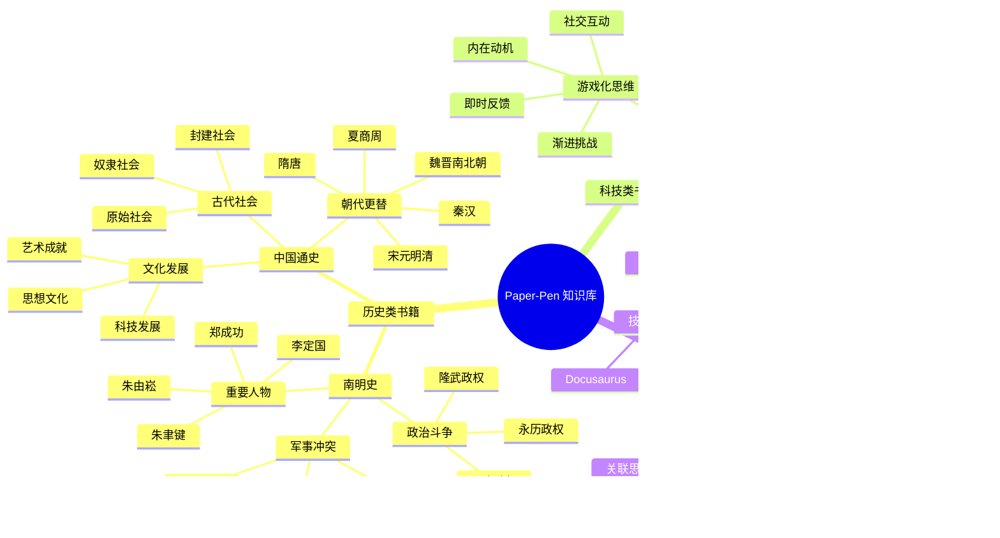
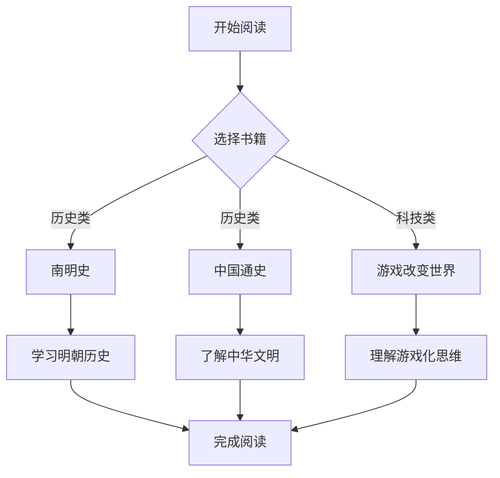
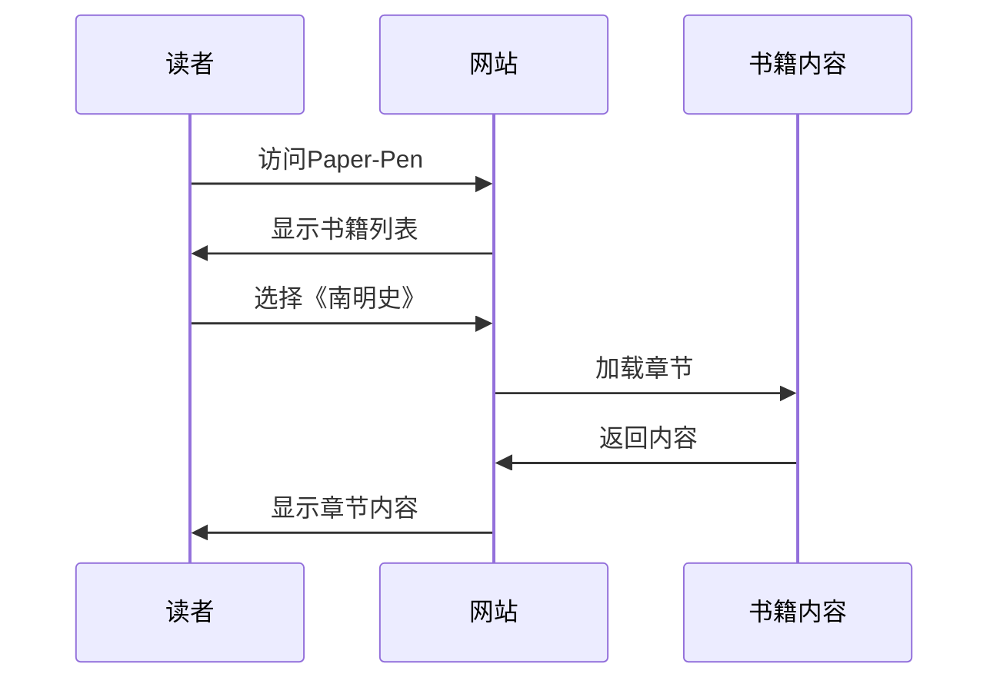
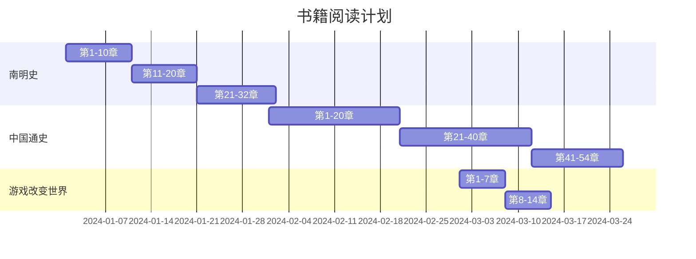
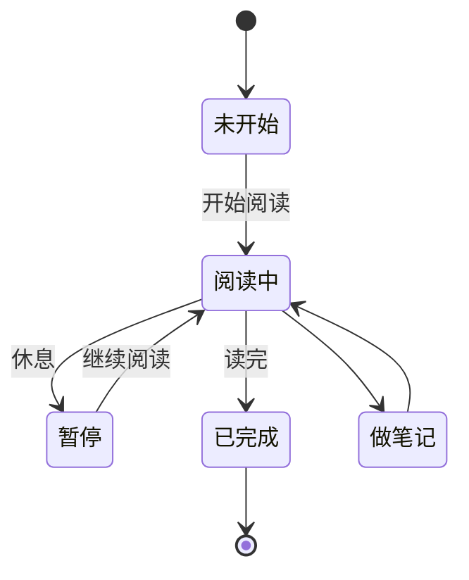
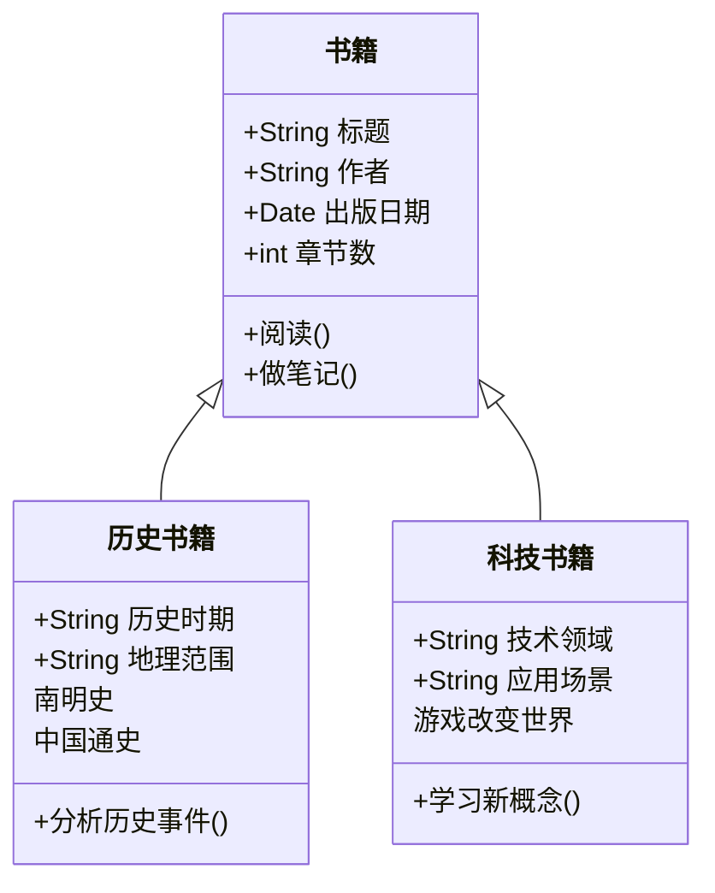
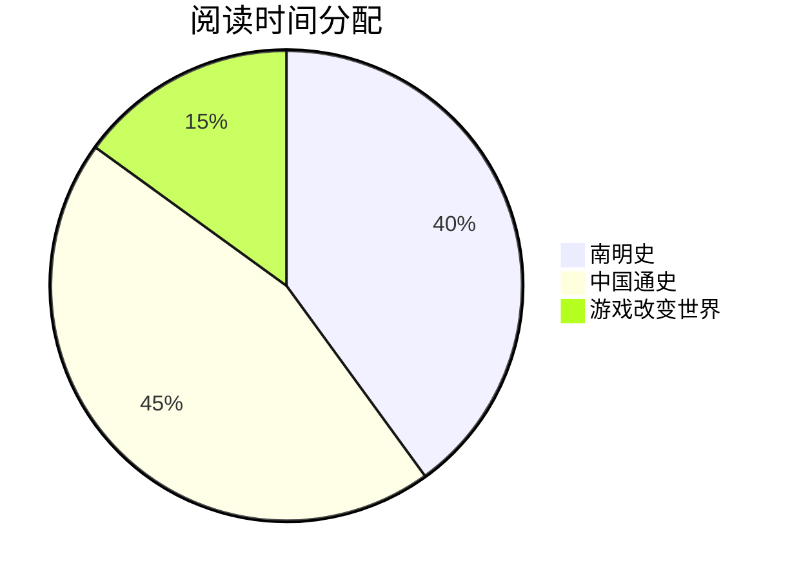
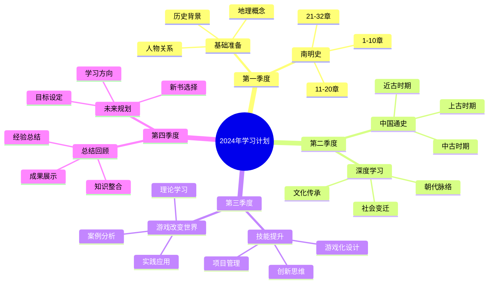

# Mermaid 图表测试

这个页面用来测试 Mermaid 图表功能。

## 脑图示例 - 知识体系结构

```mermaid
mindmap
  root((Paper-Pen 知识库))
    历史类书籍
      南明史
        政治斗争
          弘光政权
          隆武政权
          永历政权
        军事冲突
          抗清斗争
          内部分裂
          海上力量
        重要人物
          朱由崧
          朱聿键
          郑成功
          李定国
      中国通史
        古代社会
          原始社会
          奴隶社会
          封建社会
        朝代更替
          夏商周
          秦汉
          魏晋南北朝
          隋唐
          宋元明清
        文化发展
          思想文化
          科技发展
          艺术成就
    科技类书籍
      游戏改变世界
        游戏化思维
          内在动机
          即时反馈
          渐进挑战
          社交互动
        现实应用
          教育领域
          商业管理
          社会问题
          个人发展
        核心概念
          超级合作者
          平行现实
          集体智慧
          积极影响
    学习方法
      阅读策略
        章节拆分
        重点标记
        笔记整理
      知识管理
        分类归档
        关联思考
        实践应用
      技术工具
        Docusaurus
        Mermaid图表
        Markdown写作
```

## 流程图示例

```mermaid
graph TD
    A[开始阅读] --> B{选择书籍}
    B -->|历史类| C[南明史]
    B -->|历史类| D[中国通史]
    B -->|科技类| E[游戏改变世界]
    C --> F[学习明朝历史]
    D --> G[了解中华文明]
    E --> H[理解游戏化思维]
    F --> I[完成阅读]
    G --> I
    H --> I
```

## 时序图示例

```mermaid
sequenceDiagram
    participant 读者
    participant 网站
    participant 书籍内容
    
    读者->>网站: 访问Paper-Pen
    网站->>读者: 显示书籍列表
    读者->>网站: 选择《南明史》
    网站->>书籍内容: 加载章节
    书籍内容->>网站: 返回内容
    网站->>读者: 显示章节内容
```

## 甘特图示例 - 阅读计划

```mermaid
gantt
    title 书籍阅读计划
    dateFormat  YYYY-MM-DD
    section 南明史
    第1-10章     :a1, 2024-01-01, 10d
    第11-20章    :a2, after a1, 10d
    第21-32章    :a3, after a2, 12d
    section 中国通史
    第1-20章     :b1, 2024-02-01, 20d
    第21-40章    :b2, after b1, 20d
    第41-54章    :b3, after b2, 14d
    section 游戏改变世界
    第1-7章      :c1, 2024-03-01, 7d
    第8-14章     :c2, after c1, 7d
```

## 状态图示例 - 学习状态

```mermaid
stateDiagram-v2
    [*] --> 未开始
    未开始 --> 阅读中: 开始阅读
    阅读中 --> 暂停: 休息
    暂停 --> 阅读中: 继续阅读
    阅读中 --> 已完成: 读完
    已完成 --> [*]
    
    阅读中 --> 做笔记
    做笔记 --> 阅读中
```

## 类图示例 - 书籍分类

```mermaid
classDiagram
    class 书籍 {
        +String 标题
        +String 作者
        +Date 出版日期
        +int 章节数
        +阅读()
        +做笔记()
    }
    
    class 历史书籍 {
        +String 历史时期
        +String 地理范围
        +分析历史事件()
    }
    
    class 科技书籍 {
        +String 技术领域
        +String 应用场景
        +学习新概念()
    }
    
    书籍 <|-- 历史书籍
    书籍 <|-- 科技书籍
    
    历史书籍 : 南明史
    历史书籍 : 中国通史
    科技书籍 : 游戏改变世界
```

## 饼图示例 - 阅读时间分配

```mermaid
pie title 阅读时间分配
    "南明史" : 40
    "中国通史" : 45
    "游戏改变世界" : 15
```

## 脑图示例 - 个人学习计划

```mermaid
mindmap
  root((2024年学习计划))
    第一季度
      南明史
        1-10章
        11-20章
        21-32章
      基础准备
        历史背景
        人物关系
        地理概念
    第二季度
      中国通史
        上古时期
        中古时期
        近古时期
      深度学习
        朝代脉络
        文化传承
        社会变迁
    第三季度
      游戏改变世界
        理论学习
        案例分析
        实践应用
      技能提升
        游戏化设计
        项目管理
        创新思维
    第四季度
      总结回顾
        知识整合
        经验总结
        成果展示
      未来规划
        新书选择
        学习方向
        目标设定
```

这些图表展示了 Mermaid 在文档中的强大功能！
